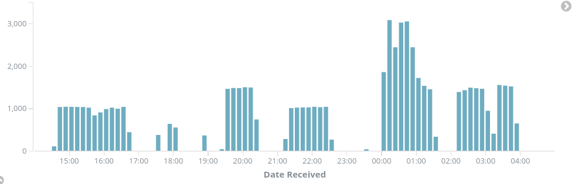

# Tracking Bots with Python 

Chris Sinchok

---

## Who am I?

- Not a data scientist |

- Pretty much just a web developer |

- Boy howdy, I am bad at pandas |

---

## What happened

- I analyzed comments on an FCC proposal |

- Found some weird patterns, and published a blog post about it |

- The post ended up getting quite a bit of traction |

---

## A short description of the issue

- The head of the FCC wants to roll back Title II regulations |

- Most tech people do not support this |

- Most ISPs would very much like this proposal to suceed

---

## Public Comments?

- Any time the FCC has a proposal, they solicit public comments |

- Comments are not an actual vote |

- Public sentiment has swayed things before |

---

## My initial goals

- Get an idea of the overall public sentiment |

- Look at how much John Oliver changed the numbers |

- Build a website to provide an analysis of the data |

---

## The FCC has a Comment API!

- Returns JSON |

- With an API key, allows posting of comments |

- Drives the ECFS frontend |

---

# Let's look at the JSON!

---?code=my-comment.json&lang=json

@[2](Every comment has a unique ID)
@[19-25](Address isn't required, but it's often present)
@[26](Email isn't visible on the web frontend, but it's available in the API)
@[35-36](These dates are effectively the same--they're the time I made the comment)
@[37](This is the date the comment was approved and posted to the website)
@[99](The comment itself)

---

## My Toolset

- Started with Jupyterm |

- Moved to an Elasticsearch backend |

- Analyzed the data with some Python scripts, storing the results in ES |

- Used a Kibana frontend for easy data viewing |

---

## First results

- There was an obvious "John Oliver" bump |

- There were a lot of duplicate text entries |

- The "John Oliver" comments were pretty easy to tag, but weren't identical |

---

## Tagging

- Grouping by "form letter" |

- Was there a full physical address? |

- Where did the comment come from? (Web, CSV, API) |

---

# The Bots

--

# Bot #1: "Unprecedented"

+++

> The unprecedented regulatory power the Obama Administration imposed on the internet is smothering innovation, damaging the American economy and obstructing job creation. I urge the Federal Communications Commission to end the bureaucratic regulatory overreach of the internet known as Title II and restore the bipartisan light-touch regulatory consensus that enabled the internet to flourish for more than 20 years. The plan currently under consideration at the FCC to repeal Obama's Title II power grab is a positive step forward and will help to promote a truly free and open internet for everyone.

+++

## Commonalities

- Duplicate text |

- Full addresses |

- Emails provided |

- Submitted over the API |

+++

## Comment Rates

+++

## Other Weirdness

- Addresses really well formatted |

- Email in ALL CAPS |

- Real people, real addresses, real emails |
