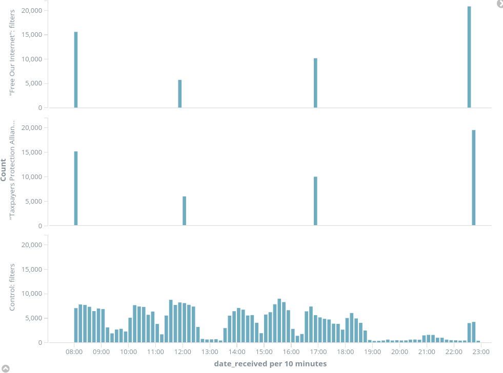
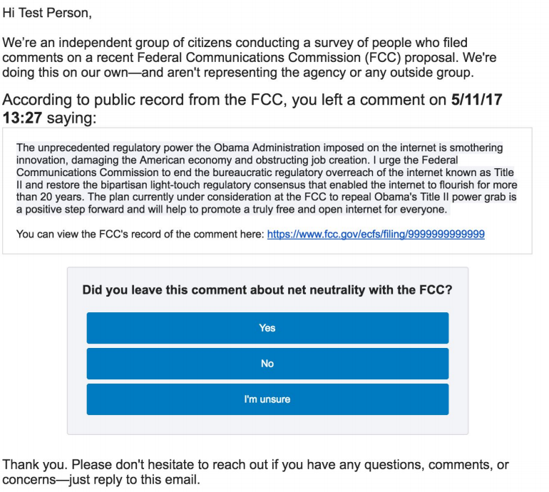

# FCC Bot Tracking

Chris Sinchok

---

## Who am I?

- Not a data scientist |

- Pretty much just a web developer |

- Boy howdy, I am bad at pandas |

Note:
Most people in this room could do something similar.
I am no genius.

---

## DISCLAIMERS

- This data is messy |

- I will be hand-waving some complexities |

- My data isn't fully up-to-date |

- Would love to answer questions after, if you'd like to know more |

Note:
I spent a ton of time looking into this, and I am distilling my findings.
I'm not done yet.
---

## What happened

- I analyzed comments on an FCC proposal |

- Found some weird patterns, and published a blog post about it |

- The post ended up getting quite a bit of traction |

---

## A short description of the issue

- The head of the FCC wants to roll back Title II regulations |

- Most tech people do not support this |

- Most ISPs would very much like this proposal to succeed |

Note:
Check out John Oliver's segment
---

## Public Comments?

- Any time the FCC has a proposal, they solicit public comments |

- Comments are not an actual vote |

- Public sentiment has swayed things before |

Note:
Comments are supposed to be legal arguments
In 2014, they were very important to show public sentiment
---

## My initial goals

- Get an idea of the overall public sentiment |

- Look at how much John Oliver changed the numbers |

- Build a website to provide an analysis of the data |

Note:
My goals went right out the window pretty quickly
---

## The FCC has a Comment API!

- Returns JSON |

- With an API key, allows posting of comments |

- Drives the ECFS frontend |

Note:
There's a resstricted API, and one that drives the website
Went down for a bit, claimed DDOS
---

# Let's look at the JSON!

---?code=my-comment.json&lang=json

@[2](Every comment has a unique ID)
@[19-25](Address isn't required, but it's often present)
@[26](Email isn't visible on the web frontend, but it's available in the API)
@[35-36](These dates are effectively the same--they're the time I made the comment)
@[37](This is the date the comment was approved and posted to the website)
@[99](The comment itself)

---

## First results

- There was an obvious "John Oliver" bump |

- There were a lot of duplicate text entries |

- The "John Oliver" comments were pretty easy to tag, but weren't identical |

Note:
My first idea was to look at the John Oliver effect
Reddit, etc, also noticed these entries
Not alphabetical!
---

## Tagging

- Grouping by "form letter" |

- Was there a full physical address? |

- Where did the comment come from? (Web, CSV, API) |

Note:
Talk about index vs analyze
---

# Group #1: "Unprecedented"

+++

> The unprecedented regulatory power the Obama Administration imposed on the internet is smothering innovation, damaging the American economy and obstructing job creation. I urge the Federal Communications Commission to end the bureaucratic regulatory overreach of the internet known as Title II and restore the bipartisan light-touch regulatory consensus that enabled the internet to flourish for more than 20 years. The plan currently under consideration at the FCC to repeal Obama's Title II power grab is a positive step forward and will help to promote a truly free and open internet for everyone.

+++

## Commonalities

- Duplicate text |

- Real people, real addresses, real emails |

- Email in ALL CAPS |

- Submitted over the API |

+++

## Comment Rates


+++

---

# Group #2: "Free our internet"

+++

> In 2015, President Obama's FCC passed rules treating the Internet as a government regulated public utility for the first time in history. Those pushing hardest for the new rules were Silicon Valley monopolies like Google and leftist globalists like George Soros.
>
> Google in fact visited the White House more than 427 times during the Obama years. Leftist foundations like Soros' Open Society and the Ford Foundation spent almost $200 million pushing for the rule change.
>
> Now we know why. In less than two years big tech and their liberal allies have taken total control of our information and communications platforms. They have used their power to flatten competitors, ban speech, censor content, routinely violate our privacy, and silence dissenting voices.
>
> While Obama's goal clearly benefited radical progressives, leftist political candidates, and his Silicon Valley corporate cronies it destroyed the free and open Internet by establishing them as our information gatekeepers.
>
> I strongly encourage the FCC to oppose efforts by the TechLeft and liberal globalists to take over our Internet. Please roll back President Obama's disastrous rules immediately. The future of a free and open Internet is at stake.

+++

## Commonalities

- Duplicate text |

- Full addresses |

- Emails provided |

- Submitted via CSV in huge groupings |

---

# Group #3 "Taxpayers Protection Alliance"

+++

> Obama's Federal Communications Commission (FCC) forced regulations on the internet that put the government, and unaccountable bureaucrats, in control. These rules have cost taxpayers, slowed down broadband infrastructure investment, and hindered competition and choice for Americans. The time to remove the regulatory stranglehold on the internet is NOW. I urge the taxpayer-funded FCC to undo the terrible regulatory burdens that ex-FCC Chairman Tom Wheeler imposed on the internet. After 20 years, and trillions of dollars in infrastructure investment, there is no reason for the government to come in and ruin what has been a thriving tool that has changed the way we all live. Chairman Pai's proposal to repeal Title II regulations will ensure the continued growth of a dynamic, open internet for all American consumers and taxpayers.

+++

## Commonalities

- Duplicate text |

- Full addresses |

- Emails provided |

- Submitted via CSV in huge groupings |

+++



---

Group #4 "Recursion"

+++

> Dear Commissioners: Regarding Net Neutrality and Title II.
> I want to implore the Federal Communications Commission to reverse Obama's decision to take over broadband.
> Individuals, rather than unelected bureaucrats, should buy whichever products we desire. Obama's decision to take over broadband is a exploitation of the open Internet.
> It reversed a free-market system that performed exceptionally successfully for many years with bipartisan approval.

+++

> To the FCC: I am a voter worried about restoring Internet freedom.
> I strongly suggest the FCC to undo Barack Obama's decision to regulate the web.
> Individuals, not unelected bureaucrats, should buy which products we desire.
> Barack Obama's decision to regulate the web is a distortion of the open Internet.
> It stopped a free-market framework that performed exceptionally successfully for two decades with nearly universal consensus.

+++

# Let's just zoom in on the first sentence...

+++

```
Dear Commissioners: Regarding Net Neutrality and Title II.
To the FCC: I am a voter worried about restoring Internet freedom.
Dear Mr. Pai, I'm concerned about the Open Internet order.
Mr Pai: I'm a voter worried about restoring Internet freedom.
FCC commissioners, My comments re: the FCC's so-called Open Internet order.
Chairman Pai: I'm contacting you about regulations on the Internet.
FCC commissioners, I have thoughts on Title II rules.
FCC: I am a voter worried about Title II rules.
FCC commissioners, I'd like to share my thoughts on Internet Freedom.
FCC: I want to give my opinion on Net Neutrality and Title II.
Dear Chairman Pai, I'm very concerned about Internet Freedom.
With respect to the Obama takeover of the Internet.
I'd like to share my thoughts on Net neutrality.
Dear Mr. Pai, In reference to Title II rules.
Dear Chairman Pai, I have thoughts on restoring Internet freedom.
I'm contacting you about restoring Internet freedom.
Dear FCC, In the matter of the future of the Internet.
```

+++

I will leave it as an exercise to the reader to recreate this in Python.

Ask me after for tips.

---

# Why do I think these are bots?

+++

## The comment rates are...suspicious

- A lot of "flat" rates
- Many blank spots
- Unnatural distributions when compared to other sources

+++

## The data is too good

- The addresses are full, and well formatted |

- No obviously fake emails, addresses |

- No one submitting twice |

+++

## There are a lot of "breached" accounts

- "Unprecedented": 67.4%
- "Free Our Internet": 74.2%
- "Outraged": 64.2%
- "Battle for the Net": 33.5%
- "John Oliver Viewers": 20.5%
- Control Sample: 31.5%

+++

## These aren't "visible" campaigns

- These aren't organizations with a ton of twitter followers |

- They aren't obviously getting traction online |

- For some of these, no one knows where the form lives |

+++

## We asked a bunch of the submitters



+++

## Survey Results

<table>
    <tr>
        <th>Source</th>
        <th>I'm Unsure</th>
        <th>No</th>
        <th>Yes</th>
        <th>Sample Size</th>
        <th>Response Rate</th>
    </tr>
    <tr>
        <td>freeourinternet</td>
        <td>1</td>
        <td>9</td>
        <td>0</td>
        <td>100</td>
        <td>10.0%</td>
    </tr>
    <tr>
        <td>unprecedented.allcaps</td>
        <td>1</td>
        <td>25</td>
        <td>3</td>
        <td>500</td>
        <td>5.8%</td>
    </tr>
    <tr>
        <td>unprecedented.lowercase</td>
        <td>2</td>
        <td>9</td>
        <td>39</td>
        <td>100</td>
        <td>50.0%</td>
    </tr>
    <tr>
        <td>battleforthenet</td>
        <td>2</td>
        <td>0</td>
        <td>29</td>
        <td>100</td>
        <td>31.0%</td>
    </tr>
    <tr>
        <td>control</td>
        <td>0</td>
        <td>0</td>
        <td>38</td>
        <td>100</td>
        <td>38.0%</td>
    </tr>
</table>

---

## So, what is the FCC gonna do?

Nothing. |

+++